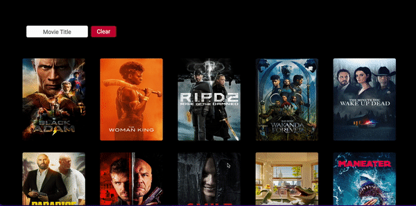
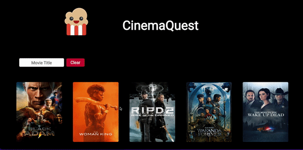

## CinemaQuest/ Rancid Tomatillos / 45 hours group project 

[Rancid Tomatillos project ](https://link-url-here.org)https://frontend.turing.edu/projects/module-3/rancid-tomatillos-v3.html)

The learning goals of this project are...
- To gain competency with React Fundamentals
- To learn and test React components and their lifeCycle methods
- To create a multi-page experience using Router 

## Motivation

It's always difficult to pick out a movie for movie night. CinemaQuest is an application with a user-friendly interface that offers a solution. A user has the ability to see a page with forty movie poster options available. If a movie becomes of interest to our user, the person can then click on the associated movie poster and be routed to a single movie view giving the user details about that specified movie. To further advance the user experience CinemaQuest implements a search bar to streamline the movie vetting process.  
 
## Screenshots / deployment link if applicable

see all movies

see a single movie

use a search bar

## Deployment
[CinemaQuest](https://bhaddad1.github.io/cinemaquest/)

## Tech/framework used

- React 
- Cypress (testing)
- Router 
- CSS, HTML, JavaScript
- ProtoType (testing params)
- JSX

## Features

Our project provides...
- A user can enter the site and see a display of movie posters with titles
- A user can click on a movie poster and be shown a single movie display
- In the single movie display vital movie information will be given. Such as: OverView, title, runtime, and ratings 
- A user has the option to click back out of the single movie and see all the movie options again 
- A user has the ability to streamline their search with a search bar that will show movies that includes certain words in realtime. 
- If no movies could be found specified from user than the user will be notified of the limitation
- If a user tried to access a page outside of the project lines an error message will be displayed guiding the user back to the heart of the application
- Upon load a user will be notified that the page is building. 

## Installation

Visit the project repository CinemaQuest 
- Copy / clone repo
- Go into terminal -- mkdir folder- cd folder 
- Run git clone [....]
- cd into project 
- run NPM start .. should see message that project is running on local host
- While keeping terminal running, open up browser and see the project deployed 

## API Reference

all movies Data: https://rancid-tomatillos.herokuapp.com/api/v2//movies

single Movie Data: https://rancid-tomatillos.herokuapp.com/api/v2//movies/movies/:movie_id

- Single movie Data was used dynamically to get respective film information 

## Tests

- Run npm i -D cypress to make sure dependency is added
- Open cypress with npx cypress open 
- Ex. A user should be able to visit the page and see a display of 40 movies-- should be green showing passing test. 

##   Experience, time frame, & Project type 
 
 CinemaQuest is a paired Project. We have been in Turing studying frontend for: 
 
 Andrew  C : 6 months 1 week
 
 Blanche H : 4 months 1 week
 
 Timeframe for this project was 12 days.
 
## GitHubs: 
 
 [Blanche Haddad (they/them)](https://github.com/BHaddad1)
 
 [Andrew Cerveny (he/him)](https://github.com/AndrewCerveny)

## Future iterations

- Adding a trailer video for each movie card 
- Adding more movies to better the experience
- Being able to separate the movies by genres 

## Challenges & Wins

Challenges:

- Having a error page shown if the user went down a bad path
- Implementing a search bar; not just filtering the movies but also showing the user a message that their movie was not on file
- Implementing Cypress testing as new software
- Balancing time commitment across two different timeZones: Eastern and Mountain

Wins: 

- Completed project in 1 week
- Implemented search functionality to filter movies by titles
- Implemented Router
- Implemented many error messages for the user to easily understand
- Implemented a new testing software 

